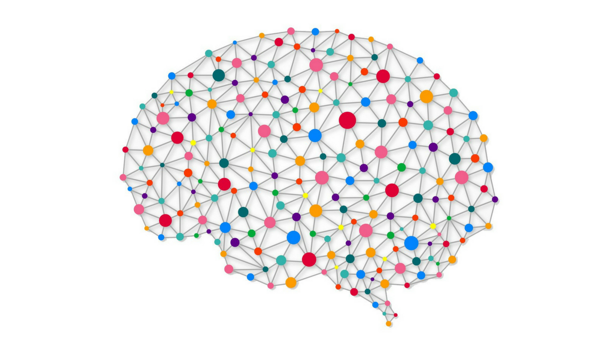
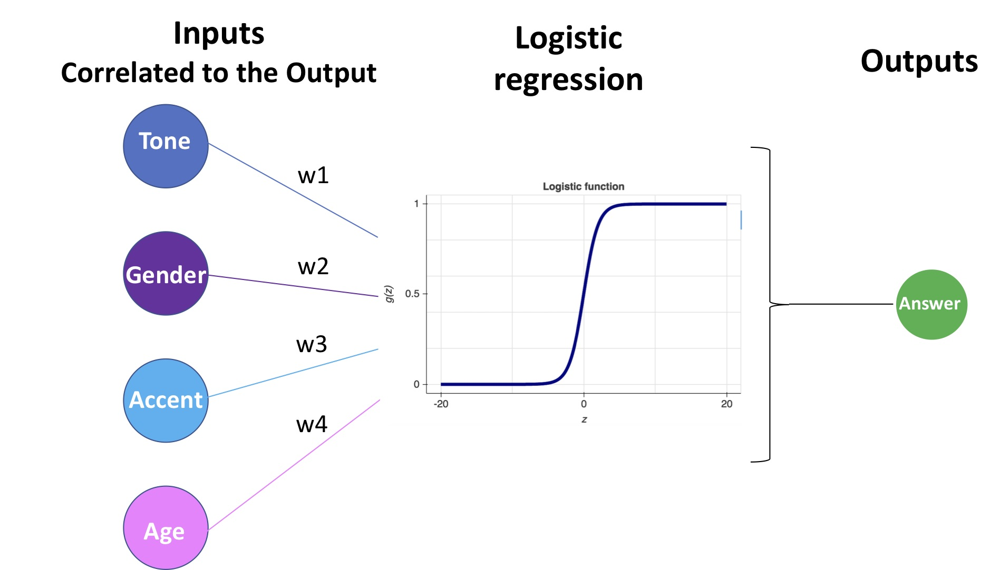
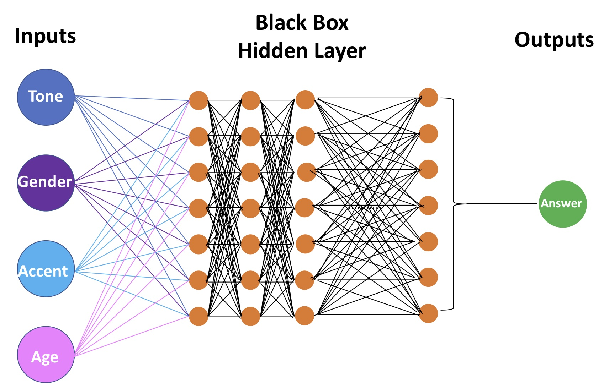
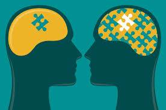

```{r, echo=FALSE, message=FALSE}
knitr::opts_chunk$set(echo = FALSE, message = FALSE)
```


## What is deep-learning?

### Where do we use deep learning?

<br>

<div class="image-link-wrapper">
  
  <p>
    Speech recognition - what a useful invention!
  </p>
</div>

<br>

But it doesn't seem to be an exact science

<div class="image-link-wrapper">
  
  <p>
    <a href="https://www.youtube.com/watch?v=QSFL2soY9hI" target="_blank">
    How embarrassing!
    </a>
  </p>
</div>


## How do they work?

<center>

```{r echo=FALSE, out.width = "55%"}

```

</center>

Deep learning algorithms use neural networks.

  - Input variables
  
  - Optimisation through hidden layers
  
  - Most suitable output
  
## Difference to simpler models?

<center>

```{r echo=FALSE, out.width = "60%"}

```

</center>

Selection of input variables

- manual application of weights
- clarity of the statistical model

## Problem of neural networks?

<center>

```{r echo=FALSE, out.width = "55%"}

```

</center>

We’re using statistical methods where computer learn to classify patterns. 

It's a greedy process: huge amount of data required for accuracy.
  
It's an opaque process: number of hidden layers.


## Solutions toward a more transparent system?

Through the data analysis worklow, implement processes for

<br>

<div class="image-link-wrapper">
  
<p>
- intput 
<br><br>
- hidden layers 
<br><br>
- output optimisation 
<br>
</p>
</div>


## Compiling data

A deep learning algorithm can only be as good as the data set which has been used to train and validate it.

<br>

<center>

```{r echo=FALSE, out.width = "60%"}

```

</center>


## Set-up of the Algorithm

“The people who understand the world, don’t understand the math. The people who understand the math, don’t understand the world”

#### unknown

<br>

<center>

```{r echo=FALSE, out.width = "60%"}

```

</center>


## Generation of the output

* Transparency of the algorithm should ensure that 

  - it is reproducible
  - we undestand why the output is generated
  - it reflects more humane values
  - we undestand what information is critical
  
<br>

"The most important skill in deep learning is not how to deploy someone else’s code; it is how to learn how those algorithms function and how to advise companies on their weaknesses"

#### Kalev Leetaru 

## Conclusion

 *Are there additional safeguards required?*

  **Yes** such as: 
  
  - algorithm designed by **multipdisciplinary** teams
  
  - generate **bias free** data content
  
  - **test and validate** algorithm models
  
<br>

 *Are there situations where deep learning should never be used?* 

Current progress makes it unlikely that there will be situations where deep learning won't be used
  
## Questions ??

<center>

```{r echo=FALSE, out.width = "60%"}
knitr::include_graphics("./images/question_mark.jpg")
```

</center>
